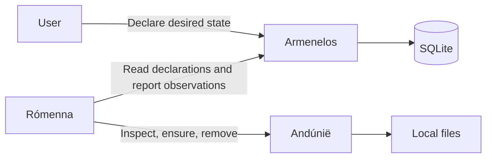

# Númenor

**A small Go laboratory for reconciliation, distributed state, and recovery.**

Status: initial architecture proposal

## Purpose

Númenor explores how independent processes cooperate to maintain a declared state, recover from failures, and eventually agree about what exists.

The initial workload is deliberately simple: maintaining local text files. This keeps the focus on reconciliation and state ownership rather than the complexity of the work itself.

The project starts with one authoritative store. Later experiments can move that authority or introduce replication, using the same workload and failure scenarios to compare behavior.

## Initial architecture

Three named components run as separate Go processes within one module.

| Component | Responsibility |
|---|---|
| **Armenelos** | Accepts declarations and persists desired state in SQLite. |
| **Rómenna** (`romenna`) | Compares desired state with reality and requests corrections. |
| **Andúnië** (`andunie`) | Maintains local files and reports what actually exists. |



All communication between components uses HTTP and JSON. Initially, everything runs on one machine with separate ports and data directories.

Suggested commands:

```text
numenor armenelos
numenor romenna
numenor andunie
```

## State ownership

The first model has clear ownership:

- **Desired state** lives in Armenelos. Its database is the authoritative record of what should exist.
- **Actual state** lives on Andúnië’s filesystem. Inspecting the file establishes reality.
- **Reported state** lives in Armenelos, written by Rómenna. It represents the most recent observation and may be stale.
- **Temporary work state**, such as retry timers, lives in Rómenna. Losing it must not lose user intent.

Only Armenelos accesses SQLite. Other components communicate with it over HTTP.

There is no transaction spanning SQLite and the filesystem. Recovery depends on inspecting reality again and safely repeating operations.

## The first resource

Begin with one resource type: `ManagedFile`.

```yaml
metadata:
  name: greeting
  uid: server-generated-unique-id
  generation: 1
  resourceVersion: 1
  deletionTimestamp: null

spec:
  contents: |
    Númenor shall stand again.

status:
  observedGeneration: 1
  phase: Ready
  actualHash: "sha256:..."
  lastObservedAt: "..."
  message: "File matches desired contents"
```

### Metadata

- `name` is the human-readable identifier.
- `uid` identifies this particular resource incarnation. Recreating a deleted name produces a new UID.
- `generation` increases when the desired contents change.
- `resourceVersion` increases on every persisted resource change and protects against stale updates.
- `deletionTimestamp` marks a resource awaiting cleanup.

### Desired state

The initial specification contains only text contents. File placement is derived from the UID:

```text
<andunie-root>/<uid>/content.txt
```

Users do not supply arbitrary filesystem paths. Keep the managed directory dedicated to this experiment and place an explicit limit on content size.

### Reported state

Begin with four phases:

- `Pending`
- `Ready`
- `Error`
- `Deleting`

`observedGeneration` identifies which desired revision was inspected. `Ready` describes an observation of that revision; it is not a permanent guarantee that the file remains correct.

## Responsibilities and contracts

### Armenelos

Armenelos provides operations to:

- Create and list resources.
- Retrieve an individual resource.
- Update desired contents.
- Record observations.
- Request deletion.
- Finalize deletion after cleanup.

Armenelos assigns metadata and validates requests. Mutations of existing resources carry UID and resource-version preconditions. The precondition check and database change happen in one transaction.

A successful declaration means the change has been committed to SQLite. It does not mean the file already exists.

Updates to desired contents are rejected once deletion begins.

### Rómenna

Rómenna runs a periodic reconciliation loop.

Start with a full scan every two seconds and one resource processed at a time. Each remote call has a deadline so an unavailable component cannot block progress indefinitely.

For each resource:

1. Read its latest declaration from Armenelos.
2. If deletion is pending, request removal from Andúnië, then finalize deletion in Armenelos.
3. Otherwise, inspect the file through Andúnië.
4. Compare the actual contents hash with the desired hash.
5. If they differ, request that Andúnië ensure the desired contents.
6. Inspect again to verify the result.
7. Record the observation using the resource version read at the start.

If a version conflict occurs, fetch the latest declaration and reconcile again. Do not overwrite newer state with an old observation.

Failures use per-resource exponential backoff with jitter and a maximum delay. Other resources continue to receive attention.

The periodic scan reconstructs work after a restart. A durable queue is unnecessary for the first version.

### Andúnië

Andúnië exposes three operations:

| Operation | Meaning |
|---|---|
| `Inspect(uid)` | Report whether the file exists and the hash of its current contents. |
| `Ensure(uid, contents)` | Make the file contain the requested text. |
| `Remove(uid)` | Ensure the resource’s managed file and directory are absent. |

Operations are idempotent: repeating a request produces the same intended result.

Andúnië serializes operations for each UID. It writes a temporary file in the target directory and renames it into place to avoid exposing partial contents.

Inspection reads the actual file rather than trusting a record of an earlier successful write.

Initial crash guarantees concern process crashes. Power-loss durability and filesystem syncing can be a separate experiment.

## Reconciliation guarantees

With services available, writable storage, and a period without new changes, the system should eventually make actual state match desired state.

It does not promise:

- Exactly-once execution.
- Immediate consistency between declarations, files, and status.
- An atomic change across Armenelos and Andúnië.
- Continuous availability during component failures.

A timeout means the outcome is unknown. The next attempt inspects reality or repeats an idempotent operation.

If desired contents change while an older operation is running, the old contents may briefly reach disk. The next reconciliation repairs them. Resource-version checks prevent that older observation from being recorded against a newer declaration.

## Deletion and recreation

Deletion is a recoverable workflow:

1. Armenelos marks the resource for deletion.
2. Rómenna requests cleanup from Andúnië.
3. Andúnië confirms absence.
4. Rómenna asks Armenelos to remove the resource record, using UID and version preconditions.

A crash between these steps leaves enough information to continue.

A recreated resource receives a new UID and therefore a different managed directory. Delayed operations for the old incarnation cannot remove the new incarnation’s file.

The initial version has one Rómenna process. Multiple competing instances require additional coordination and are outside the first milestone.

## Implementation structure

```text
cmd/numenor/
internal/armenelos/
internal/romenna/
internal/andunie/
internal/resource/
internal/store/
internal/client/
tests/integration/
docs/architecture.md
```

Use Go’s standard HTTP and JSON packages where practical, with a SQLite driver selected during implementation.

Keep boundaries around persistence and remote operations. Reconciliation should consume declarations and observations without depending on SQLite directly.

Build only the initial model. Avoid introducing a generic framework or configurable replication strategies before the first experiment works.

## Observability

Structured logs should make one resource’s progress easy to follow. Include:

- Component name.
- Resource name and UID.
- Desired generation.
- Operation and result.
- Duration and retry delay.
- Errors and version conflicts.

Record observation timestamps, but avoid rewriting unchanged status on every scan. Refresh it on meaningful changes and at a slower heartbeat interval.

A logging or metrics platform is not required to begin.

## Build milestones

### 1. Make one file converge

Implement declarations, persistence, inspection, creation, and status reporting.

**Done when:** submitting desired contents creates a file, and changing those contents updates it.

### 2. Repair drift

Compare actual contents on subsequent scans.

**Done when:** manually editing or removing the file is detected and repaired.

### 3. Recover from interruption

Add deadlines, retries, version checks, and restart recovery.

**Done when:** killing Rómenna after a file write but before status reporting does not prevent eventual convergence.

### 4. Delete safely

Implement pending deletion, cleanup, finalization, and UID isolation.

**Done when:** interrupted deletion resumes, and recreating the same name cannot be damaged by operations targeting its previous UID.

These four milestones form the first complete version.

## Failure experiments

| Experiment | Expected behavior |
|---|---|
| Repeat a write request | Same final contents, without duplicate artifacts. |
| Edit a managed file manually | Rómenna detects and repairs drift. |
| Remove a managed file manually | The file is recreated. |
| Stop Andúnië | Requests fail within their deadlines; Rómenna retries. |
| Restart Armenelos | Persisted declarations remain available. |
| Kill Rómenna after a successful write | Restart discovers the actual file and reports its state. |
| Lose a response after a write | Inspection or a repeated request recovers safely. |
| Change desired contents during reconciliation | Newest contents eventually win; stale status is rejected. |
| Interrupt deletion | Cleanup resumes from the persisted deletion marker. |
| Delete and recreate a name | The new UID isolates the replacement resource. |
| Make storage unwritable | The failure is visible and recovery occurs once access is restored. |

Use unit tests for reconciliation decisions and version handling, integration tests for component contracts, and process-level tests for crash recovery.

Where possible, trigger faults at explicit checkpoints rather than relying on arbitrary sleeps.

## Future state models

Keep the workload and failure experiments stable while changing one architectural property at a time.

### Model 1: The registry

Armenelos owns desired state. Rómenna reads it and coordinates changes.

This is the initial implementation and comparison baseline.

### Model 2: The steward

Move durable desired state into Rómenna. Armenelos becomes the entrance through which declarations are submitted.

Explore how moving authority changes acknowledgement, availability, and recovery. A successful submission must still have a clearly defined durability boundary.

### Model 3: The common record

Replicate desired state across participants.

Choose explicitly between:

- Coordinating acceptance to maintain one agreed history.
- Accepting changes independently and defining how they merge later.

A replicated set can describe which resources exist, but file contents require a mapping from resource identity to desired values. Concurrent edits, deletion, and recreation need defined conflict rules.

Replication of knowledge does not automatically grant permission to act. File ownership and competing writers remain separate questions.

Do not implement these later models until the initial system provides a dependable baseline.

## Scope boundary

The first version contains one Armenelos, one Rómenna, and one Andúnië, running locally.

It does not include scheduling, containers, multiple storage destinations, leader election, distributed consensus, authentication, or a general-purpose resource system. Bind the initial endpoints to loopback.

The first useful outcome is small and observable:

**Declare what should exist, disturb it, and watch Númenor restore it.**